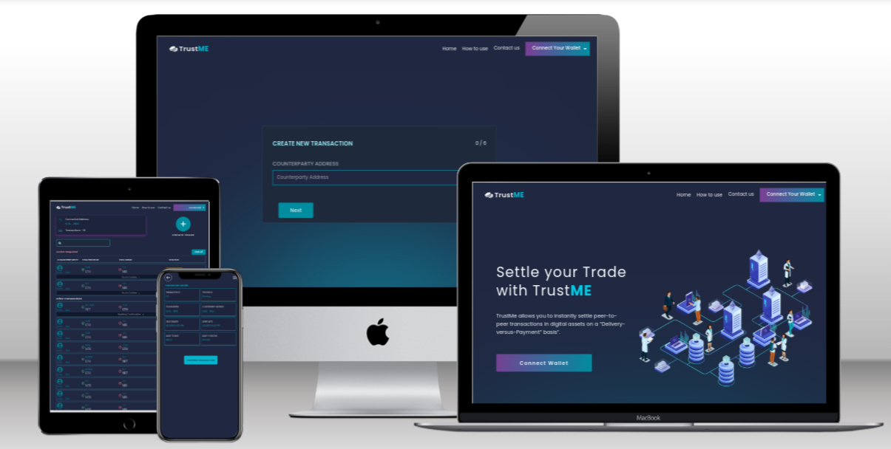

<div style="background-color:#202741; padding: 10px;margin-bottom:20px; text-align:center; ">
       
</div>

# TrustMe Settlement

TrustMe Settlement is a full-fledge blockchain application which serves trade partners to process their with a middleman is replaced by a smart contract and everything is settled on a single ledger.

## App Screenshot

<div style="background-color:white; padding: 10px;">
    
   
</div>

## Built with

    - Major languages: Solidity, TypeScript, TailwindCSS, Next.js
    - Technologies used: ESLint, Prettier, VSCode, Git, GitHub

## Prerequisites

    - Node.js installed on local system
    - yarn (Package Manager)
    - npm ( Node Package Manager )
    - Git and Github Account

## Getting Started

To get a local copy of this application run the following steps:

- Open terminal
- Change to your desired directory then run the following:

  - run `git@github.com:mengiefen/TrustMe-Settlements.git`
  - `cd TrustMe-Settlements/`
  - run `git switch dev`
  - run `yarn install`
  - run `yarn dev`

## How to setup the application

- Open terminal
- Change to your desired directory then run the following:
  - run `git@github.com:mengiefen/TrustMe-Settlements.git`
  - `cd TrustMe-Settlements/`
  - run `git switch dev`
  - run `yarn install`
- create .env file on the root directory
- populate created file with the following environment variables

  ```
  NEXT_PUBLIC_ALCHEMY_API=your_alchemy_goerli_api_key
  NEXT_PUBLIC_CONTRACT_ADDRESS= your_contract_address
  ```

- run `yarn dev`

## How to use TrustMe

> The first step is to use the TrustMe Services is to connect with your wallet. You need to have an Ethereum web3 browser extension wallet services.
> The next step to use the TrustMe Services to settle your trade transactions. It is Simple. Safe & Reliable.

**Deployment on Vercel**

> ### [Live Website](https://trust-me-settlements.vercel.app/)

## Authors

👤 **Mengstu Fentaw**

- Github: [@mengiefen](https://github.com/mengiefen)
- Twitter: [@MengistuFentaw](https://twitter.com/MengistuFentaw)
- Linkedin: [@mengefen](https://www.linkedin.com/in/mengefen/)

👤 **Gabriel Vince**

- Github: [@Mr-Biskit](https://github.com/Mr-Biskit)
- Twitter: [@mr\_\_biskit](https://twitter.com/mr__biskit)
- Linkedin: [@gabriel-vince-017059214](https://www.linkedin.com/in/gabriel-vince-017059214/)

👤 **Rushikesh Jadhav**

- Github: [@Rushikesh0125](https://github.com/Rushikesh0125)
- Twitter: [@Rushike57195546](https://twitter.com/Rushike57195546)
- Linkedin: [@rushi441](https://www.linkedin.com/in/rushi441/)

👤 **Nico**

- Github: [@mengiefen](https://github.com/mengiefen)
- Twitter: [@MengistuFentaw](https://twitter.com/MengistuFentaw)
- Linkedin: [@mengefen](https://www.linkedin.com/in/mengefen/)

👤 **Anmol Pokhrel**

- Github: [@pokhrelanmol](https://github.com/pokhrelanmol)
- Twitter: [@0xanmol](https://twitter.com/0xanmol)
- Linkedin: [@](https://www.linkedin.com/in//)

## 🤝 Contributing

Contributions, issues, and feature requests are welcome!

Feel free to check the [issues page](https://github.com/yersel500/recipe-app/issues).

## Show your support

Give a ⭐️ if you like this project!

## Acknowledgments

- Alchemy University: [AU community](https://university.alchemy.com/)

- Alchemy: [Alchemy Website](https://www.alchemy.com/)

## 📝 License

This project is [MIT](./LICENSE) licensed.
